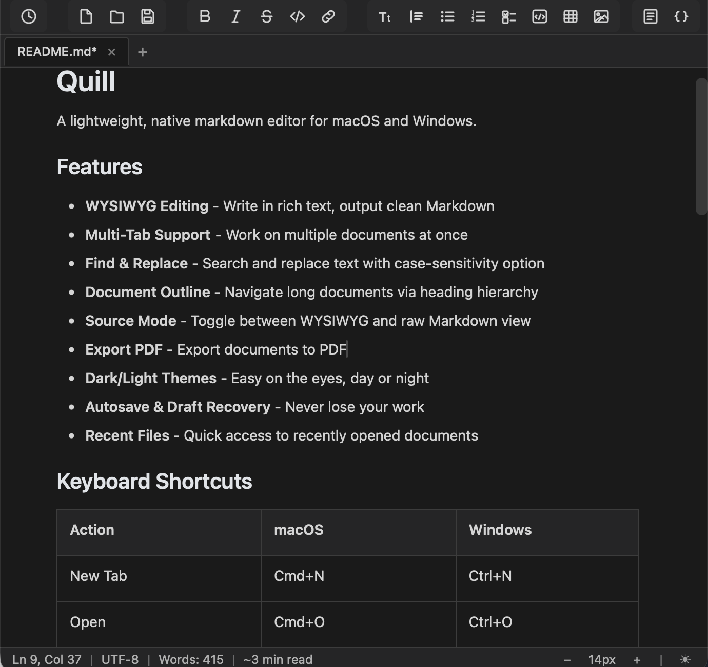

# Quill

A lightweight, native markdown editor for macOS and Windows.



## Features

- **WYSIWYG Editing** - Write in rich text, output clean Markdown
- **Multi-Tab Support** - Work on multiple documents at once
- **Find & Replace** - Search and replace text with case-sensitivity option
- **Document Outline** - Navigate long documents via heading hierarchy
- **Source Mode** - Toggle between WYSIWYG and raw Markdown view
- **Dark/Light Themes** - Easy on the eyes, day or night
- **Autosave & Draft Recovery** - Never lose your work
- **Recent Files** - Quick access to recently opened documents

## Keyboard Shortcuts

| Action | macOS | Windows |
|--------|-------|---------|
| New Tab | Cmd+N | Ctrl+N |
| Open | Cmd+O | Ctrl+O |
| Save | Cmd+S | Ctrl+S |
| Save As | Cmd+Shift+S | Ctrl+Shift+S |
| Close Tab | Cmd+W | Ctrl+W |
| Find | Cmd+F | Ctrl+F |
| Replace | Cmd+H | Ctrl+H |
| Bold | Cmd+B | Ctrl+B |
| Italic | Cmd+I | Ctrl+I |
| Strikethrough | Cmd+Shift+X | Ctrl+Shift+X |
| Link | Cmd+K | Ctrl+K |
| Code Block | Cmd+Shift+C | Ctrl+Shift+C |
| Heading 1/2/3 | Cmd+1/2/3 | Ctrl+1/2/3 |
| Toggle Source | Cmd+/ | Ctrl+/ |
| Zoom In/Out | Cmd++/- | Ctrl++/- |
| Next/Prev Tab | Cmd+Tab | Ctrl+Tab |

## Installation

### macOS

1. Download `Quill.app` from Releases
2. Move to Applications folder
3. Double-click to run

### From Source

```bash
# Clone the repository
git clone https://github.com/yourusername/quill.git
cd quill

# Set up Python environment
python3 -m venv venv
source venv/bin/activate  # macOS/Linux
pip install -r requirements.txt

# Install JavaScript dependencies
cd ui
npm install
npm run build
cd ..

# Run the app
python main.py
```

## Tech Stack

- **Python** + **PyWebView** - Native window with embedded WebView
- **Milkdown** - WYSIWYG Markdown editor built on ProseMirror
- **esbuild** - Fast JavaScript bundling

## Project Structure

```
Quill/
├── main.py              # Entry point
├── requirements.txt     # Python dependencies
├── src/
│   ├── api.py           # Python API exposed to JavaScript
│   ├── window.py        # Window management
│   └── settings.py      # Settings persistence
├── ui/
│   ├── index.html       # Main HTML
│   ├── css/             # Stylesheets
│   ├── js/              # JavaScript modules
│   └── package.json     # Node dependencies
└── Quill.app            # macOS app bundle
```

## License

MIT
