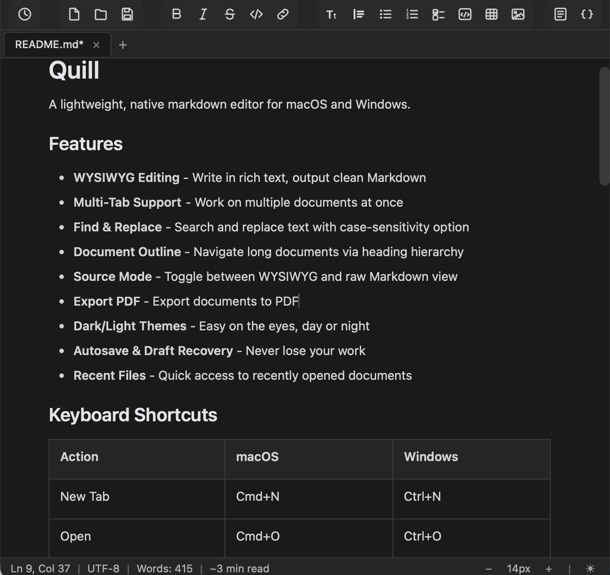

# Quill

A lightweight, native markdown editor for macOS and Windows.



## Features

- **WYSIWYG Editing** - Write in rich text, output clean Markdown
- **Multi-Tab Support** - Work on multiple documents at once
- **Find & Replace** - Search and replace text with case-sensitivity option
- **Document Outline** - Navigate long documents via heading hierarchy
- **Source Mode** - Toggle between WYSIWYG and raw Markdown view
- **Export PDF** - Export documents to PDF
- **Dark/Light Themes** - Easy on the eyes, day or night
- **Autosave & Draft Recovery** - Never lose your work
- **Recent Files** - Quick access to recently opened documents

## Keyboard Shortcuts

| Action | macOS | Windows |
|--------|-------|---------|
| New Tab | Cmd+N | Ctrl+N |
| Open | Cmd+O | Ctrl+O |
| Save | Cmd+S | Ctrl+S |
| Save As | Cmd+Shift+S | Ctrl+Shift+S |
| Close Tab | Cmd+W | Ctrl+W |
| Find | Cmd+F | Ctrl+F |
| Replace | Cmd+H | Ctrl+H |
| Bold | Cmd+B | Ctrl+B |
| Italic | Cmd+I | Ctrl+I |
| Strikethrough | Cmd+Shift+X | Ctrl+Shift+X |
| Link | Cmd+K | Ctrl+K |
| Code Block | Cmd+Shift+C | Ctrl+Shift+C |
| Bullet List | Cmd+Shift+8 | Ctrl+Shift+8 |
| Heading 1/2/3 | Cmd+1/2/3 | Ctrl+1/2/3 |
| Toggle Source | Cmd+/ | Ctrl+/ |
| Word Wrap | Alt+Z | Alt+Z |
| Zoom In/Out | Cmd++/- | Ctrl++/- |

## Installation

### macOS

1. Download `Quill.dmg` from Releases
2. Open and drag to Applications
3. Double-click to run — `.md` files can be opened with Quill via "Open With"

### From Source

```bash
git clone https://github.com/mutantspoon/public-projects.git
cd public-projects/Quill

# Install JavaScript dependencies
cd ui
npm install
npm run build
cd ..

# Run in dev mode
cargo tauri dev

# Production build
cargo tauri build
# Output: src-tauri/target/release/bundle/
```

## Tech Stack

- **Tauri 2** + **Rust** - Native window with embedded OS WebView (~10MB binary)
- **Milkdown** - WYSIWYG Markdown editor built on ProseMirror
- **esbuild** - Fast JavaScript bundling

## Project Structure

```
Quill/
├── src-tauri/
│   ├── Cargo.toml           # Rust dependencies
│   ├── tauri.conf.json      # Window config, file associations
│   └── src/
│       └── main.rs          # Rust commands + app state
└── ui/
    ├── index.html           # Main HTML shell
    ├── css/                 # App styles and themes
    ├── js/                  # JavaScript modules
    └── package.json         # Node dependencies
```

## License

MIT
